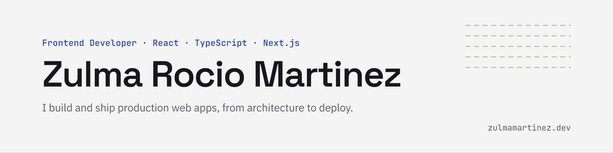

<a href="https://zulmamartinez.dev">
  <picture>
    <source media="(prefers-color-scheme: dark)" srcset="banner-dark.png" />
    
  </picture>
</a>

Frontend developer with 4+ years of production experience, now open to
remote frontend and full-stack roles.

[Portfolio](https://zulmamartinez.dev) ·
[Resume](https://zulmamartinez.dev/resume.pdf) ·
[LinkedIn](https://www.linkedin.com/in/zulma-rocio-martinez/)

## Stack

React · TypeScript · Next.js · TanStack Query · Zustand · Zod · Auth0 ·
Tailwind CSS · Cypress · Cloudflare · Python / Flask

## Projects

- **[Portfolio](https://github.com/Rocio01/portafolio-2026)**: my personal
  site in English and Spanish, with light and dark themes. Next.js static
  export, TypeScript, Tailwind CSS, Cloudflare Pages.
  [Live](https://zulmamartinez.dev)
- **[Attention training game](https://github.com/Rocio01/juego-atencion)**: a
  cognitive training web app I built for my parents. Difficulty adapts to each
  player with a staircase algorithm. Vite, React, TypeScript, Cloudflare
  Workers. [Demo](https://juego-atencion.zrmartinezg.workers.dev/)
- **[Next.js template](https://github.com/Rocio01/nextjs-template)**: the
  minimal starter I use for static sites. Next.js App Router, TypeScript
  strict, Tailwind CSS, Vitest, Cypress and GitHub Actions.

## A different path into code

Before software, I trained as a veterinarian and worked in poultry production.
I moved into development through Microverse's remote full-stack program, pair
programming with developers around the world, and went straight into building
a production platform.

I'm used to working independently and owning decisions end to end. Spanish native,
advanced English.
